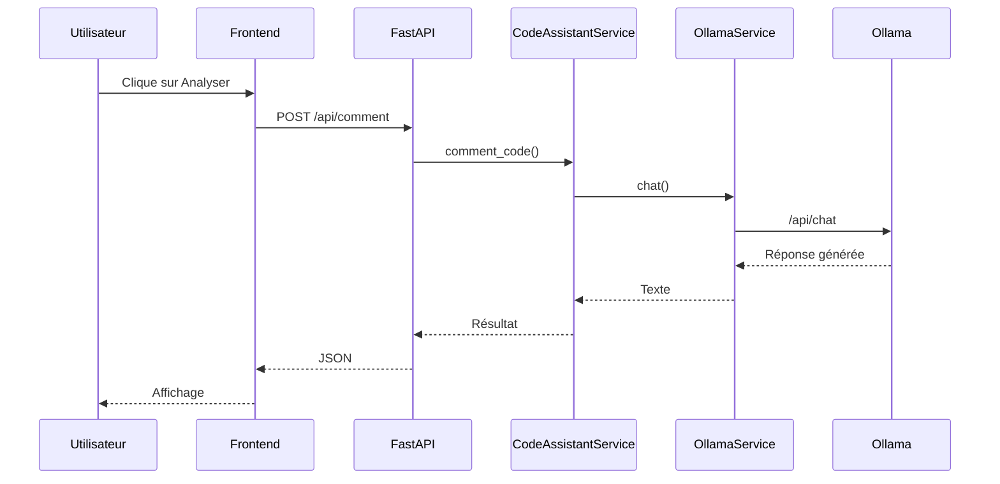

# Documentation Développeur – Architecture et Flux Complet de CodeScribe

# 1. Vue d'ensemble

CodeScribe est une application web composée de :

- Un frontend HTML/CSS/JavaScript
- Un backend FastAPI
- Un moteur LLM via Ollama
- Un système d'historique JSON

Objectif :

```text
Code utilisateur
    ↓
Frontend
    ↓
API FastAPI
    ↓
Service métier
    ↓
LLM Ollama
    ↓
Réponse générée
    ↓
Frontend
```

---

# 2. Architecture générale

```text
┌─────────────────────┐
│     Utilisateur     │
└──────────┬──────────┘
           │
           ▼
┌─────────────────────┐
│      Frontend       │
│ HTML / JS / CSS     │
└──────────┬──────────┘
           │ HTTP
           ▼
┌─────────────────────┐
│      FastAPI        │
│ app/routers         │
└──────────┬──────────┘
           │
           ▼
┌─────────────────────┐
│ CodeAssistantService│
└──────────┬──────────┘
           │
           ▼
┌─────────────────────┐
│   OllamaService     │
└──────────┬──────────┘
           │ HTTP
           ▼
┌─────────────────────┐
│       Ollama        │
│      llama3.2       │
└──────────┬──────────┘
           │
           ▼
┌─────────────────────┐
│  Réponse générée    │
└─────────────────────┘
```

---

# 3. Cycle de vie complet d'une requête

## Étape 1 : démarrage de l'application

Fichier :

```text
app/main.py
```

```python
from app.core.factory import create_app

app = create_app()
```

Cette ligne crée toute l'application FastAPI.

---

## Étape 2 : création de FastAPI

Fichier :

```text
app/core/factory.py
```

Responsabilités :

- création de l'application ;
- ajout du middleware CORS ;
- enregistrement des routes ;
- exposition du frontend.

```python
app.include_router(health.router)
app.include_router(code.router)
```

Puis :

```python
app.mount("/", StaticFiles(...))
```

Le frontend devient accessible directement.

---

## Étape 3 : affichage de la page

Exemple :

```text
frontend/index.html
```

Le navigateur charge :

```html
<script src="js/api.js"></script>
```

Le code JavaScript devient disponible.

---

## Étape 4 : clic utilisateur

L'utilisateur clique :

```html
<button id="submit-btn">
```

Le listener exécute :

```javascript
callCodeScribe("comment")
```

---

## Étape 5 : construction de la requête

Dans :

```text
frontend/js/api.js
```

```javascript
fetch("/api/comment")
```

Le payload JSON contient :

```json
{
  "code": "...",
  "comment_level": "2",
  "max_comment_length": 120
}
```

---

## Étape 6 : réception FastAPI

Route :

```python
@router.post("/comment")
```

FastAPI :

1. reçoit le JSON ;
2. valide le schéma ;
3. crée automatiquement un objet Python.

Schéma :

```text
app/schemas/code.py
```

```python
CodeRequest
```

---

## Étape 7 : injection de dépendances

Fichier :

```text
app/core/dependencies.py
```

Création unique :

```python
ollama_service = OllamaService(...)

code_assistant_service = CodeAssistantService(
    ollama_service
)
```

Le même objet est réutilisé partout.

---

# 4. Service métier

Fichier :

```text
app/services/code_assistant_service.py
```

C'est le cerveau applicatif.

Responsabilités :

- création des prompts ;
- règles métier ;
- nettoyage des réponses ;
- délégation vers Ollama.

---

## Commentaire de code

Méthode :

```python
comment_code()
```

Création du prompt système :

```python
system_prompt = "..."
```

Création du prompt utilisateur :

```python
user_prompt = "..."
```

Puis :

```python
await self.ollama_service.chat()
```

---

## Contrôle qualité

Méthode :

```python
control_code()
```

Le prompt demande :

- erreurs ;
- sécurité ;
- performance ;
- bonnes pratiques.

---

## Compression

Méthode :

```python
compress_code()
```

Le prompt demande :

- réduction de taille ;
- conservation du comportement ;
- optimisation.

---

# 5. Communication avec Ollama

Fichier :

```text
app/services/ollama_service.py
```

Responsabilité unique :

```text
Parler avec le LLM
```

---

## Construction du payload

```python
payload = {
    "model": self.model,
    "stream": False,
    "messages": [...]
}
```

---

## Requête HTTP

```python
POST /api/chat
```

URL :

```text
http://ollama:11434/api/chat
```

---

# 6. Ce qui se passe dans Ollama

Ollama reçoit :

```text
System Prompt
+
User Prompt
```

Il transmet ces informations au modèle :

```text
llama3.2
```

Le modèle :

1. tokenize ;
2. raisonne ;
3. prédit les tokens ;
4. génère une réponse.

Puis renvoie :

```json
{
  "message": {
    "content": "..."
  }
}
```

---

# 7. Retour vers FastAPI

Extraction :

```python
data["message"]["content"]
```

Nettoyage éventuel :

```python
_clean_code_response()
```

---

# 8. Historisation

Fichier :

```text
app/services/history_service.py
```

Ajout dans :

```text
data/history.json
```

Structure :

```json
{
  "date": "...",
  "action": "...",
  "input": "...",
  "result": "..."
}
```

---

# 9. Retour API

Objet :

```python
CodeResponse
```

Transformé automatiquement en JSON.

Exemple :

```json
{
  "action": "comment",
  "result": "Résultat du LLM"
}
```

---

# 10. Affichage frontend

Dans :

```javascript
const data = await response.json();

output.value = data.result;
```

La zone :

```html
<textarea id="result-output">
```

affiche immédiatement le résultat.

---

# 11. Diagramme de séquence Mermaid



---

# 12. Points d'extension

Pour ajouter une nouvelle fonctionnalité :

## Backend

Créer :

```python
async def explain_algorithm(...)
```

dans :

```text
CodeAssistantService
```

Puis une route :

```python
POST /api/explain
```

---

## Frontend

Ajouter :

```javascript
callCodeScribe("explain")
```

---

# 13. Résumé final

Le chemin critique est :

```text
main.py
    ↓
factory.py
    ↓
Frontend
    ↓
api.js
    ↓
Router FastAPI
    ↓
CodeAssistantService
    ↓
OllamaService
    ↓
Ollama / llama3.2
    ↓
Réponse
    ↓
Historique
    ↓
Frontend
    ↓
Utilisateur
```

C'est ce flux qui constitue le coeur complet de CodeScribe.
